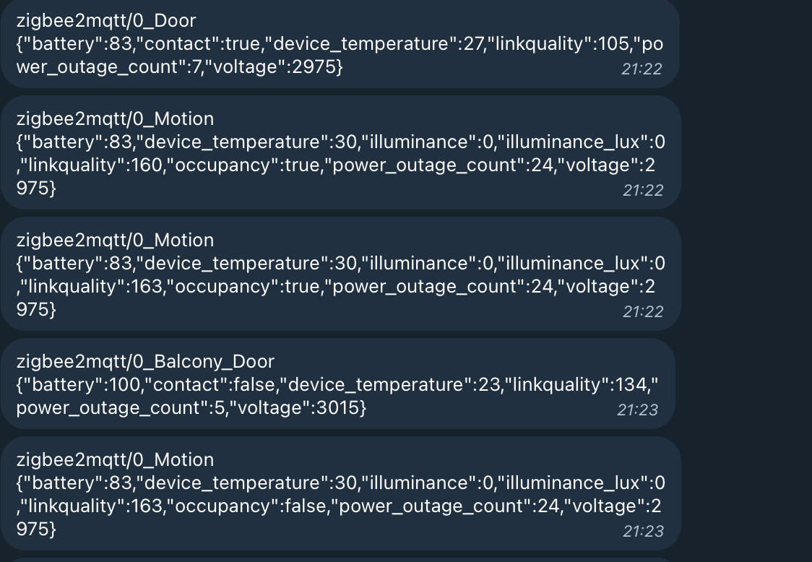

## Why

Currently a Node-Red instance subscribed to MQTT topics is dumping messages to a Telegram bot. 



Reading MQTT messages one by one does not allow me to derive valuable insights. I want to have more information about my patterns, observe health and status of my home sensors.

Moreover, I control everything using Homebridge. Apple being Apple™, they don't allow you to access Apple Home without Apple HomePod. 
I want to watch a RTSP stream of my house, observe and control my devices without selling my soul to corporate overlords.

How hard can it be?

## Ingredients

- **Server**: I use [Zigbee2MQTT](https://www.zigbee2mqtt.io/)  as this project is unparalleled when it comes to eliminating the need for proprietary Zigbee bridges. Therefore, you need a server to run it. You can grab a [Raspberry Pi](https://www.raspberrypi.com/). I use a [HP t530 Thin Client](https://www.ebay.de/itm/144913355269?epid=17016765429) acquired during RPI shortage for €30. It should have an [MQTT broker](https://www.mosquitto.org/download/) installed. 
- **Zigbee adapter**: You must grab an adapter compatible Zigbee2MQTT. This project uses [SONOFF Zigbee 3.0 USB Dongle Plus](https://www.amazon.de/-/en/gp/product/B09KXTCMSC?)
- **Camera with RTSP stream**: I have an [E1 Pro](https://www.amazon.de/Reolink-%C3%9Cberwachungskamera-Kameramonitor-IR-Nachtsicht-SD-Kartenslot-4mp-Wlan-Kamera-Schwarz/dp/B08S6TKP26) lying around to use for this projects
- **RTSP to HLS converter**: RTSP stream must be consumable via browser. Hence, we need to host a converter. Previously I hosted ffmpeg instances but currently using [RTSPtoWeb](https://github.com/deepch/RTSPtoWeb) as it is fully native
- **Sensors**: Any compatible with Zigbee2MQTT. Here is a list of supported and affordable [contact](https://www.zigbee2mqtt.io/supported-devices/#v=SONOFF,Aqara&e=contact) and [occupancy](https://www.zigbee2mqtt.io/supported-devices/#e=occupancy&v=SONOFF,Aqara) sensors currently used in my house
- **Lights** *(or plugs connected to lights)*: For this project, I will use a plug to control the light located in my studio, as I don't want to screw and unscrew my lights. Here is a list of supported and affordable [plugs](https://www.zigbee2mqtt.io/supported-devices/#v=Nous&s=smart%20plug) and [lights](https://www.zigbee2mqtt.io/supported-devices/#s=smart%20light&v=Nous) currently used in my house

**You need to bring your ingredients and deployment strategies of your choice. This project only contains the React front-end that allows you to monitor health, control devices and watch the stream, and a back-end to process and serve the data end-points.**


> [!CAUTION]  
> This dashboard, should never, ever be exposed to internet. I will expose it once for the demo.
> Once the demo is over, only the devices connected to [Nebula](https://github.com/slackhq/nebula) peer-to-peer network will be able to access the dashboard. Given that dashboard is exposed to the internet, camera is aimed to an unoccupied area of the house and only the studio light can be controlled.


## Preparing the environment

You will need: 

- [node](https://nodejs.org/en/)
- [yarn](https://yarnpkg.com/)

However, using [asdf](https://asdf-vm.com/) is recommended. By keeping the .tools-versions file up to date, we can keep nodejs and yarn runtime conflicts to minimum.

### Managing dependencies and runtime versions

- Get asdf [as per the documentation](https://asdf-vm.com/guide/getting-started.html)
- Install required asdf plugins
```shell
asdf plugin add nodejs https://github.com/asdf-vm/asdf-nodejs.git
asdf plugin add yarn https://github.com/twuni/asdf-yarn.git
```
- Navigate to project directory and install local runtime versions
```shell
asdf install
```
- Project uses yarn monorepos. Install dependencies in the root folder
```shell
yarn
```

### Building the project

Straightforward. Run script of choce from ```application``` package. 


### Setting HLS stream URL

Obtain the ```.m3u8``` URL for your stream and change the existing url in ```@/components/Video```. Stream URL is hard-coded for the time being.

### Generating data and serving endpoints

In order to control your MQTT devices, you need to subscribe to topics and publish messages. Therefore, you need to know which topic your device listens. There is more information on Zigbee2MQTT documentation.
Edit ```server/devices.json``` to define your devices. Your devices must expose ```contact: boolean``` and ```status: "ON | "OFF"``` properties.

- Navigate to ```server``` package
- Copy your Zigbee2MQTT ```log``` to a static folder. If your Zigbee2MQTT is deployed to a server, you can copy the file with ```scp```
```shell
scp $USER@$IP:${Zigbee2MQTTLogAbsolutePath}/log.txt /static/log.txt
```
- Generate data and serve endpoints
```shell 
yarn generateJsonFromLog
yarn dev
```


> [!IMPORTANT]  
> This express server and data processing methods are set up for demo only. They are scheduled for deprecation in favour of GraphQL and PostgreSQL.
